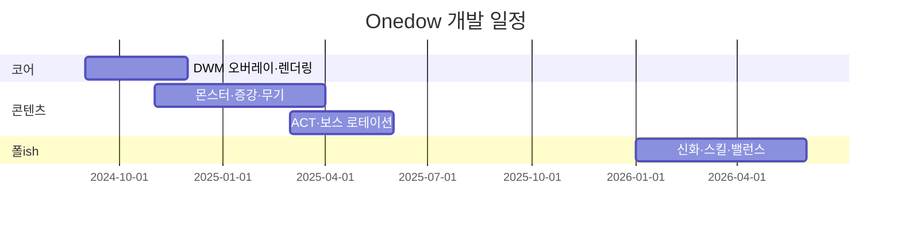

# Onedow — 게임 발표 PPT 슬라이드별 원고

> 예시 PPT(`게임발표_예시PPT.pptx`) 10장 구조 그대로.  
> `[ ]` 안은 직접 넣을 이미지·영상·이름 등. 슬라이드에 복붙해서 쓰면 됩니다.

---

## 01 · GAME INTRODUCTION

**메인 타이틀**
```
Onedow
```

**부제 / 한 줄 소개**
```
바탕화면 위에서 펼쳐지는 가짜 OS 창 서바이벌 로그라이트
```

**팀 소개**
```
개발: Rid (1인 개발)
기획 · 프로그래밍 · 아트(벡터/네온 UI)
```

**개발 기간**
```
2024.09 ~ 2026.06
```

**장르**
```
2D 탑다운 · 로그라이트 · 슈팅 · 데스크톱 오버레이
```

**[메인 스크린샷 자리]**
- 추천: 플레이어 `Onedow.exe` 창 + 주변에 떠 있는 적/보스 가짜 창들이 보이는 전체 화면
- 또는 UNKNOWN.sys 보스전 (거대검 + 화면 가장자리 pin)

**[로고 / 아이콘 자리]**
- `Onedow.exe` 타이틀바 + 네온 테두리 플레이어 창 캡처

**태그라인 (발표 멘트용)**
```
“진짜 Windows 바탕화면이 전장이 되는, 창 단위 시야의 로그라이트”
```

---

## 02 · GAMEPLAY VIDEO

**슬라이드 제목**
```
02 · GAMEPLAY VIDEO
```

**안내 문구**
```
실제 플레이 영상 (1~2분 권장)
```

**[영상 삽입]**
- 녹화 순서 제안:
  1. 메인 메뉴 → 난이도 선택 → 무기 3택1
  2. 레벨업 증강 선택 1회
  3. 가짜 창 사이 이동 + 사격
  4. 보스 등장(예: VOLLEY / UNKNOWN / FORK.worm)
  5. 디버프 카드 or 런 상점 1컷
  6. 게임 오버 → 메타 코인/업적

**캡션 (영상 하단)**
```
조작: WASD 이동 · 마우스 조준 · 좌클릭 사격 · 스페이스 스킬 · ESC 일시정지
```

---

## 03 · DEVELOPMENT OVERVIEW

**슬라이드 제목**
```
03 · DEVELOPMENT OVERVIEW
```

### 장르
```
2D 탑다운 액션 로그라이트
데스크톱 오버레이(Win32 DWM 투명 창) 기반
```

### 주요 특징 ①
```
가짜 OS 창 = 시야 & 전장
```
- 플레이어·적·보스가 각각 `.exe` / `.sys` 형태의 Fake Window를 소유
- **창 안에서만** 월드가 렌더링 — 바탕화면 밖은 전투 구역 아님
- 여러 창에 걸친 총알·보스는 창마다 클리핑 렌더 패스

### 주요 특징 ②
```
로그라이트 빌드 — 증강 · 디버프 · 조합 · 신화
```
- 레벨업 시 3장 카드 픽 (일반~전설 + 에픽 조합 + 디버프)
- 시작 무기 6종 중 3택1 (SMG / 저격 / 소총 / 샷건 / 대포 / 리볼버)
- 직업 5종 (방랑자·암살자·광전사·폭격수·흡혈귀) — 업적으로 해금
- 액티브 스킬 최대 3슬롯 (창 닫기·과부하·시간정지·집중조준 등)

### 주요 특징 ③
```
ACT 테마 보스 & 무한 구간
```
- 보스 클리어 시 ACT 전환 — 해당 보스 테마에 맞는 스폰·난이도 bias
- 5보스 클리어 후 **ACT ∞ ENDLESS**
- 보스 예: UNKNOWN.sys(검객 pin) · VOLLEY.sys · GLITCH.exe · C2_RELAY · FORK.worm · RITE.CORE 등

### 레퍼런스 게임 ①
```
Vampire Survivors
```
- 자동/반자동 성장 + 빌드 조합의 중독성

### 레퍼런스 게임 ②
```
OneShot (창 넘나드는 연출)
```
- “창”이라는 UI가 게임플레이와 맞물린다는 발상

### 레퍼런스 게임 ③
```
Windows 바탤러 / 데스크톱 메타포 계열
```
- OS·프로세스·바이러스를 적·보스 이름으로 치환

### 레퍼런스 설명 (본문)
```
서바이벌의 “한 판 더” 욕구와 데스크톱 UI의 친숙함을 합쳤습니다.
다만 단순 탄막 회피가 아니라, **어느 창에 서 있느냐**가 생존과 가독성을
동시에 결정합니다. 증강·디버프·조합 레시피는 빌드 실험을, ACT 보스는
런마다 다른 “환경 디버프” 같은 긴장감을 줍니다.
```

---

## 04 · GAME CONCEPT

**슬라이드 제목**
```
04 · GAME CONCEPT
```

### 기획 의도
```
“내 컴퓨터 바탕화면”이라는 익숙한 공간을 깨뜨리되,
낯설지 않게 — 창·작업표시줄·.exe 파일명으로 세계관을 설명한다.
```

### 한 줄 요약
```
가짜 윈도우 창 단위 시야의 2D 로그라이트 — OS가 깨지면서 몬스터와 보스가 팝업처럼 퍼진다.
```

### 다른 게임과의 차별점
```
① 전투가 “화면 전체”가 아니라 “창 단위”로 클리핑됨
② DWM 투명 오버레이 — 실제 바탕화면 위에 게임이 떠 있음
③ 적/보스도 각자 창을 가짐 → 멀티 윈도우 z-order가 전술 요소
④ 디버프를 고르는 로그라이트 (D_DDOS, D_WEAVER_BOOST 등)
⑤ 보스마다 ACT 전체 스폰 테마가 바뀜 (예: FORK.worm = 분열·스웜 bias)
```

### 플레이어가 느끼는 재미
```
· “창 밖으로 나가면 안 보인다”는 직관적 시야 규칙 익히기
· 증강 조합으로 빌드 폭발 (연쇄·차크람·드론·신화 특이점 등)
· 보스 패턴별 전조 읽기 (pin / 탄막 / 돌진 / 의식망)
· 한 판 짧게 → 메타 코인·업적·직업 해금으로 다시 도전
```

### 타깃 플레이어
```
· 로그라이트·빌드덕 후 타입
· Windows/인디 UI 메타포 좋아하는 유저
· Vampire Survivors류 숙련자 중 “한 단계 다른 시야 규칙” 원하는 사람
```

### 발표 멘트 (자유 작성용)
```
“창을 닫고, 창을 가로질러, 창 밖으로 몰려오는 적을 맞추는 게임입니다.”
```

---

## 05 · DEVELOPMENT TIMELINE

**슬라이드 제목**
```
05 · DEVELOPMENT TIMELINE
```

**타임라인 (월별 — 예시 PPT 가로 막대에 맞춤)**

| 기간 | 마일스톤 |
|------|----------|
| **2024.09~10** | 기획 · Win32 DWM 투명 오버레이 POC · OpenGL 배치 렌더 |
| **2024.11~12** | Fake Window · 플레이어 이동/사격 · 몬스터 스폰 · EXP/증강 1차 |
| **2025.01~02** | 보스 1~2종 · 메타 코인/상점 · 세이브 · 다국어(KR/EN/JP) |
| **2025.03~04** | ACT 시스템 · 보스 로테이션 · 디버프/조합 증강 · 크리에이티브 모드 |
| **2025.05~06** | 보스 대량 추가(GLITCH/C2/FORK/RITE/UNKNOWN) · 밸런스 패스 |
| **2026.01~03** | 신화 등급 · 스킬 슬롯 · 런 상점 · UI/패널 개편 |
| **2026.04~06** | UNKNOWN 검객 보스 · 증강 확장 · QA · 발표/출시 준비 |

**Mermaid (발표 자료 보조용 — PPT에 넣어도 됨)


---

## 06 · DEVELOPMENT PROCESS

**슬라이드 제목**
```
06 · DEVELOPMENT PROCESS
```

### 핵심 기술 ①
```
Win32 DWM Layered Window + OpenGL 3.3
```
- 투명 프레임버퍼 → 실제 바탕화면 비침
- `BatchFlush` CPU 배치 — Scissor/Blend/Shader 변경 전 flush 강제

### 핵심 기술 ②
```
Fake Window 멀티 패스 렌더링
```
- `WorldScissor(wx,wy,ww,wh)` 로 창 단위 클리핑
- z-order: 몬스터 창 → 플레이어 창 → 보스/블ade.sys 미니창

### 핵심 기술 ③
```
로그라이트 시스템 스택
```
- GameManager 상태머신 (메뉴·런·증강·디버프·보스 휴식·런상점)
- Augment 등급/조합/디버프 · SaveSystem · BossDirector ACT rules

### 주요 버그 리포트 (예시 PPT 표 형식)

| ID | 증상 | 원인 | 해결 |
|----|------|------|------|
| **BUG-01** | 보스/검 투사체가 안 보임 | 창 로컬 좌표로 그려 WorldScissor 밖으로 클립 | 월드 좌표 + 창별 렌더 패스로 수정 |
| **BUG-02** | 디버프 선택 화면이 새까맣게 보임 | 전체 오버레이 α(0.80) + 설명 박스 α 겹침 | 오버레이 0.62 + 적갈 틴트로 가독성 확보 |
| **BUG-03** | 창 밖에서 자폭병 터지면 파편 안 보임 | 파편도 창 scissor 내부만 렌더 | 데스크톱 패스 추가 (진행 중 / TODO) |

**기술 스택 (추가 슬라이드 여백용)**
```
C++17 · OpenGL 3.3 · GLFW · glm · Win32 API · MSBuild x64
```

---

## 07 · GAME FLOW

**슬라이드 제목**
```
07 · GAME FLOW
```

### 진행 단계 (Stage 느낌 — 런 내부)

| # | 이름 | 내용 |
|---|------|------|
| **1** | **ACT 0 · BOOT** | 워밍업 — 기본 몬스터·증강 익히기, 낮은 intensity cap |
| **2** | **ACT 1~5** | 보스 클리어할 때마다 ACT 테마 변경 — 스폰/속도/엘리트 bias |
| **3** | **ACT ∞** | 5보스 클리어 후 ENDLESS — intensity 상한 해제 |

### 플레이 플로우차트 (PPT 도형용 텍스트)

```
[메인 메뉴]
    ↓
[난이도 선택] ──→ (크리에이티브: 시작점수·보스·증강 지정)
    ↓
[직업 선택] (해금된 클래스)
    ↓
[시작 무기 3택1]
    ↓
[인게임 RUNNING] ←──────────────────┐
    · 이동/사격/대시                   │
    · EXP → 레벨업 → [증강 3택1]       │
    · (조건) [디버프 3택1]             │
    · (조건) [런 상점]                 │
    · 보스 HP 임계 → [보스 경고]       │
    ↓                                  │
[보스전]                               │
    ↓                                  │
보스 처치? ─NO→ 계속 RUNNING ──────────┘
    ↓ YES
[보스 인터미션 / ACT 전환]
    ↓
5보스 클리어? ─NO→ RUNNING
    ↓ YES
[ENDLESS RUNNING …]
    ↓
HP 0 → [DYING] → [GAME OVER]
    ↓
[코인·업적·도감] → 메인 메뉴
```

### 한 줄 설명
```
“한 판 = 메뉴에서 빌드 고르고 → ACT가 바뀌며 보스를 깨는 런 → 죽으면 메타 성장”
```

---

## 08 · ART DIRECTION

**슬라이드 제목**
```
08 · ART DIRECTION
```

### 비주얼 키워드 ①
```
네온 다크 UI
```

### 비주얼 키워드 ②
```
가짜 Windows 10/11 창 크롬
```

### 비주얼 키워드 ③
```
벡터 실루엣 + 글로우 (Immediate 없이 배치 삼각형)
```

### 컬러 팔레트 (PPT 색칩용)

| 이름 | HEX | 용도 |
|------|-----|------|
| Desktop Black | `#0A0A0C` | 바탕/딤 |
| Window Body | `#12141C` | 창 본체 |
| Panel Gray | `#4A4E5A` | UI 패널 |
| Neon Cyan | `#4DF0FF` | 플레이어/정보 accent |
| Neon Magenta | `#F23394` | UNKNOWN / 위험 |
| Boss Orange | `#FF8C33` | VOLLEY / 경고 |
| HP Red | `#E8384F` | 체력·디버프 |
| Text White | `#E8EAED` | 본문 |

*코스메틱 액센트 테마 7종 — 메타 상점에서 해금 가능*

### 폰트 스타일
```
Microsoft YaHei UI (다국어 공통)
· 한글/일본어 시스템 폴백
· UI: 작은 픽셀 느낌의 고정 scale 텍스트 (TextRenderer)
```

### UI 아이콘
```
증강·스킬·무기 — Icons/ PNG + 벡터 폴백
· 미니멀 flat + 네온 테두리
· .exe / .sys / .dll 파일명이 보스·창 이름
```

### 아트 레퍼런스
```
· OneShot — 창 메타
· Hypnospace Outlaw — OS UI 톤
· Vampire Survivors — HUD 밀도·가독성
· Windows 11 Fluent (아이콘·타이틀바 parody)
```

**[스크린샷 / GIF 자리]**
- 메인 메뉴 + 작업표시줄
- 증강 3장 카드 UI
- GLITCH.exe 보스 morph
- UNKNOWN.sys 화면 가장자리 pin + blade.sys

---

## 09 · PLAY FEEDBACK

**슬라이드 제목**
```
09 · PLAY FEEDBACK
```

> ⚠️ 아래 수치는 **내부 플레이테스트 가안**입니다.  
> 실제 설문 후 `평균`/`응답자 수`만 교체하세요. (예시 PPT의 레이더 차트용)

### 테스트 개요
```
테스터: 00명  →  [실제 숫자]
전체 평균: 0.0 / 7  →  [예: 5.4 / 7]
최고/최저 항목: [예: Q3 몰입도 최고 · Q4 난이도 최저]
```

### 항목별 평균 (7점 만점)

| 문항 | 내용 | 가안 점수 |
|------|------|-----------|
| **Q1** | 재미 / “한 판 더” | 5.6 |
| **Q2** | 그래픽 / UI 가독성 | 5.1 |
| **Q3** | 몰입도 / 세계관(OS 메타) | 6.0 |
| **Q4** | 난이도 적절성 | 4.5 |
| **Q5** | 완성도 / 버그 체감 | 5.0 |

### 정성 피드백 (발표용 인용)

**긍정**
- “창 밖으로 나가면 안 보이는 규칙이 신선하다”
- “증강 조합이 많아서 빌드 짜는 재미가 있다”
- “보스 이름이 .sys/.exe라서 분위기 살아난다”

**부정**
- “초반 EXP가 느리다 / 후반 너무 빨라진다”
- “보스 패턴이 처음엔 뭐가 위험한지 모르겠다”
- “증강 아이콘 없는 것들이 텍스트만 있어 구분이 어렵다”

**PPT 하단 안내 (예시 PPT 그대로)**
```
설문 결과는 스프레드시트 AVERAGE 함수로 계산 후 차트에 반영
```

---

## 10 · FUTURE IMPROVEMENTS

**슬라이드 제목**
```
10 · FUTURE IMPROVEMENTS
```

### 개선 ① — 튜토리얼
```
피드백: “창 시야 규칙을 처음에 모르겠다”
→ 대응: ACT 0 짧은 튜토리얼 (창 안/밖, z-order, 대시) + 크리에이티브 샌드박스 안내
```

### 개선 ② — 난이도 커브
```
피드백: “난이도가 갑자기 튄다 / 보스가 어렵다”
→ 대응: ACT별 intensity ramp 완만화 · 보스별 telegraph 강화 · EASY/NORMAL/HARD 재조정
```

### 개선 ③ — BGM / SFX
```
피드백: “BGM이 단조롭다”
→ 대응: ACT·보스 테마별 BGM 스템 · 증강/레벨업 SFX 다양화
```

### 추가 개선 (슬라이드 여분 / 발표 Q&A용)

| 우선순위 | 항목 |
|----------|------|
| 🔴 | AMD GPU 실기 테스트 · 크래시 로그 분석 |
| 🟡 | 증강 아이콘 전량 PNG · 해상도/창모드/키 리바인드 |
| 🟢 | Steam 페이지 · 트레일러 · 검객/궁수 DLC 직업 |
| 🟢 | UNKNOWN.sys / SPAM.dll / HANG.exe 정식 로테이션 합류 |

### 마무리 멘트
```
“바탕화면을 지키는 방법은 창을 닫는 것뿐이 아닙니다.”
→ Onedow, 감사합니다.
```

---

## 부록 · 발표 3분 / 5분 / 10분 컷

### 3분
01 소개 → 03 특징 3개 → 07 플로우 → 02 영상 30초 → 10 마무리

### 5분
+ 04 컨셉 차별점 → 06 BUG-01 창 렌더링 스토리 → 08 스크린샷 2장

### 10분
+ 05 타임라인 → 09 피드백 → UNKNOWN 보스 데모 → Q&A

---

## 부록 · 스크린샷 체크리스트

- [ ] 메인 메뉴 (바탕화면 비침)
- [ ] 증강 선택 3카드
- [ ] 디버프 선택 (적갈 오버레이)
- [ ] 플레이어 창 + 몬스터 창 다수
- [ ] VOLLEY / GLITCH / FORK / RITE 보스 각 1장
- [ ] UNKNOWN.sys — 거대검 + edge pin + CAGE
- [ ] 런 상점 / 메타 상점
- [ ] 업적 · 직업 해금
- [ ] ACT ∞ ENDLESS HUD
